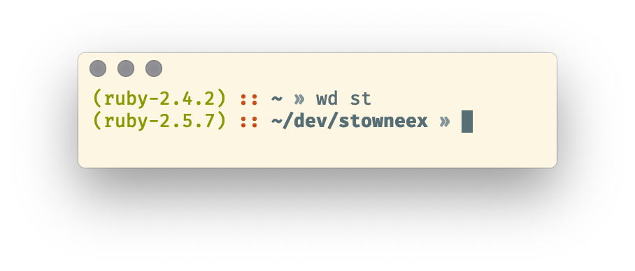

cypher-ruby is just like the [cypher](https://github.com/ohmyzsh/ohmyzsh/blob/master/themes/cypher.zsh-theme) zsh theme but with ruby version in your prompt.

## Why use cypher?
- It does not show git branch in your prompt, hence performance of prompt re-appearing is much faster, closer to plain zsh or bash.

## Why use cypher-ruby?
- If you're a rubyist and you often get caught into a wrong ruby version trap, then displaying the version right in your prompt is a good choice.

## Usage
`git clone https://github.com/ston1x/cypher-ruby.git $ZSH_CUSTOM/themes/cypher-ruby`

`ln $ZSH_CUSTOM/themes/cypher-ruby/cypher-ruby.zsh-theme $ZSH_CUSTOM/themes/cypher-ruby.zsh-theme`

Add `ZSH_THEME="cypher-ruby"` to your .zshrc

## This theme on [awesome-zsh-plugins](https://github.com/unixorn/awesome-zsh-plugins/)
This theme [was published](https://github.com/unixorn/awesome-zsh-plugins/pull/844/commits/4783af03600f7973e5c2b50fbedd150de3b476cb) on awesome-zsh-plugins
